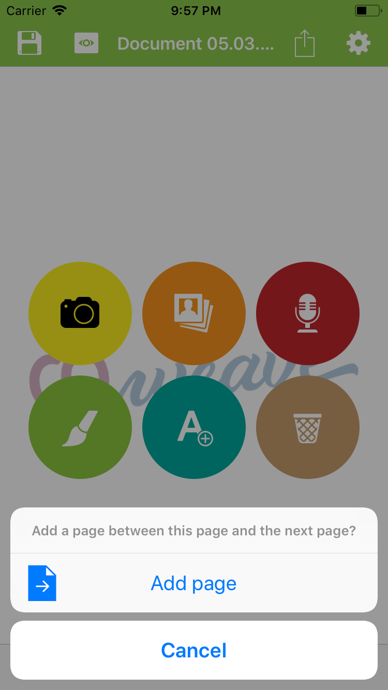

  
  <h3 align="center">coWeave Documentation</h3>

This repository provides a documentation to show you how to use all the features of the coWeave App.
If you have any questions or suggestions, please create an issue or a pull-request.

## Table of contents

- [Getting started](#getting-started)
- [Documents](#documents)
  - [Create document](#create-document)
  - [Pages](#pages)
    - [Page actions](#page-actions)
      - [Take Picture](#take-picture)
      - [Choose picture from gallery](#choose-picture-from-gallery)
      - [Record audio](#record-audio)
      - [Draw](#draw)
      - [Add text](#add-text)
      - [Delete](#delete)
    - [Add page](#add-page)
      - [Add page between](#add-page-between)
    - [Pages list](#pages-list)
      - [Add page title](#add-page-title)
      - [Jump to page](#jump-to-page)
  - [Document settings](#document-settings)
    - [Rename document](#rename-document)
    - [Assign to user](#assign-to-user)
    - [Templates](#templates)
      - [Set as template](#set-as-template)
      - [Import from template](#import-from-template)
  - [Share](#share)
    - [coWeave file](#coWeave-file)
    - [zip file](#zip-file)
  - [Open documents](#open-documents)
    - [Attributed to a user](#attributed-to-a-user)
    - [Not attributed to a user](#not-attributed-to-a-user)
- [Viewer Mode](#viewer-mode)
- [Groups](#groups)
  - [Add group](#add-group)
  - [Modify group name](#add-group-name)
  - [Users](#users)
    - [Add user](#add-user)
    - [Modify user name](#modify-user-name)
  - [Share groups](#share-groups)
- [Settings](#settings)
  - [Select language](#select-language)

## Getting started
- Download the [coWeave iOS App](https://itunes.apple.com/lu/app/coweave/id1313935192?ls=1&mt=8)
- Download the [coWeave Viewer App](https://itunes.apple.com/lu/app/coweave-viewer/id1315689686?mt=12)

## Documents
On the first view you have two options:

- [Create document](#create-document)
- [Open documents](#open-documents)

### Create document
Select the circle button on the first view with a "+" icon.
### Pages
#### Page actions
On every page you have different options:

- [Take Picture](#take-picture)
- [Choose picture from gallery](#choose-picture-from-gallery)
- [Record audio](#record-audio)
- [Draw](#draw)
- [Add text](#add-text)
- [Delete](#delete)

##### Take picture
A picture can be taken using the camera (Yellow circle). After taking a picture the photo editor is opened.

##### Choose picture from gallery
A picture can be selected from your device gallery (Orange circle). After selecting a picture the photo editor is opened.

##### Record audio
Audio is recorded until you press the red circle again. After recording, the audio is played and you can choose to save it or delete it.

##### Draw
The photo editor opens and you can draw, add stickers or text.

##### Add text
The photo editor opens and you can draw, add stickers or text.

##### Delete
You can delete:
- the page
- the attached audio
- the attached photo

#### Add page
Press the right outline button on the bottom of the page.

##### Add page between
Press and hold the right button on the bottom of the page.

This doesn't work on the last page, as it is used to add a page between to other pages.

Example: you have Page 1, Page 2. Then you can add a Page between Page 1 and 2. To do this, you have to press and hold the right arrow on the first page.
The page is added after the current page.

#### Pages list
All pages are listed.

##### Add page title
To add a page title, press the blue "i" button in the page cell.

##### Jump to page
Tap the cell of a page to jump to the corresponding page.

### Document settings

#### Rename document
Enter a new name in the "Name" field and press done.

#### Assign to user
Select a group and a user to assign to a user. After this you can see all the different documents from one user.

#### Templates
##### Set as template
Select the Template check box.

##### Import from template
Press the cell of the document you want to import.
To use a template you have to first create a document and then import from template.

### Share
Select two file types on export:

- [coWeave file](#coWeave-file)
- [zip file](#zip-file)

You can share these files via the default iOS sharing action. For example send via AirDrop, send via Message, Email or upload to Dropbox, One drive.

#### coWeave file
This can be opened with the coWeave App on another device. You can even open a .coweave file on a Mac using the coWeave Viewer App available on the Mac App Store.

#### zip file
This allows you to get one folder/page including the audio file and the picture. They are bundled in a zip file and can be opened on any computer and make it possible to use the pictures or audio in another way.

### Open Documents
#### Attributed to a user
Select the icon in the top right corner. Then select the group, the user and push the cell of the document you want to open.
#### Not attributed to a user
Simply push the cell of the document you want to open.

## Viewer Mode
The viewer mode allows you to present the document without editing options. This for example is useful for parent meetings or presentations at university.
The audio of every page is played back automatically.

## Groups
### Add group
Press the "+" button in the top right corner. Then enter the name in the alert view and press "Add".

### Modify group name
To modify a name, press the "i" button. Then edit the name and save.
### Users
#### Add user
Press the "+" button in the top right corner. Then enter the name in the alert view and press "Add".
#### Modify user name
To modify a name, press the "i" button. Then edit the name and save.
### Share groups
See also [Share](#share). This option allows you to export all documents from one group. This can take longer if there are many documents.

## Settings
### Select language
You can select German, French or English as language. You have to restart the app after having selected the language.

## License

Check out the [LICENSE](LICENSE) file.
